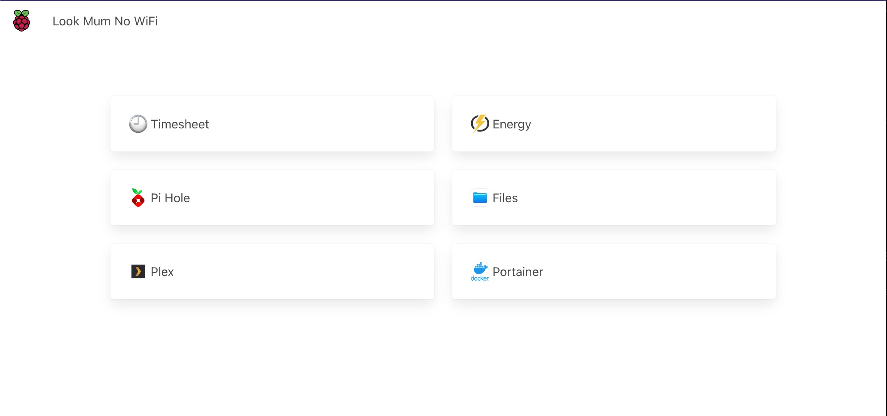
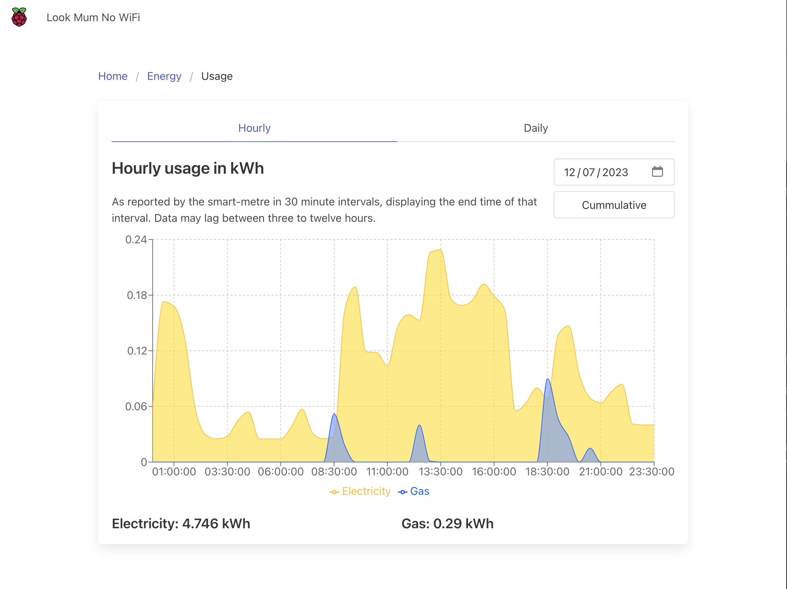
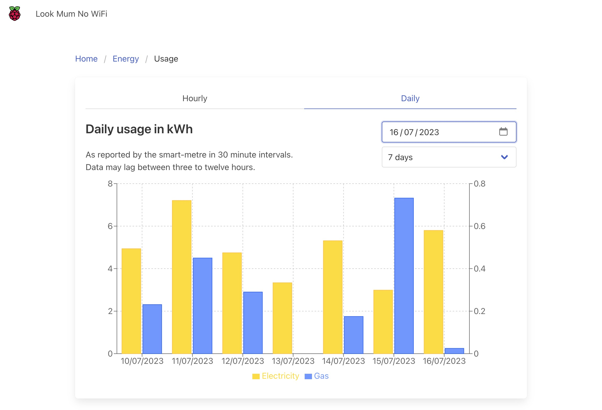

> ⚠️ This repo is no longer in use. All custom apps written here have either been deprecated, or replaced by public alternatives.

# Piserver

This repository should allow for a quick and simple deployment of essential web apps to a Raspberry Pi.

It contains the basic server configurations, docker-compose files as well as a custom dashboard application

## Getting started

### Server aspect

The workload is currently split between two machines, `raspberry` and `strawberry` as too many docker containers were running for one to handle reliably.

Copy the `./scripts` folder onto both machines and run `./scripts/raspberry.sh` and/or `./scripts/strawberry.sh` accordingly.

Both will install docker, and docker compose, as well as their respective other containers detailed below. `raspberry.sh` will also set up /dev/sda2 to be mounted into /media/hdd

### Dashboard

- [ ] Create a `.env` file and populate it following the example provided in `.env.example`
- [ ] Install dependencies using `npm install`
- [ ] Set up your database (see below)
- [ ] Develop: `npm run dev` to start a local dev instance
- [ ] Deploy
  - [ ] Vercel
  - [ ] Run `npm run build` to create a production build
  - [ ] Use the Dockerfile provided to build the NextJS App

#### How to set up your database from scratch

If you are forking this repository and don't have any data yet, you might find it easiest to delete the `./drizzle` folder and run the DB setup from scratch.

Run `npm run generate`, which will provide you with a plain .sql file, located in `./drizzle` that will build up your database according to the schemas defined in `./src/db`. You will then need to connect to your database yourself and apply the migration - copy/paste/run the provided .sql file. You will then want to keep these migration files checked into your repository so that you can apply changes as you go.

#### How to set up your database from existing work

In the `./drizzle` folder you will find DB Migration files named in order in which they should be applied in. Run every SQL file in order against your database. If you make any changes to the DB structure, run `npm run generate` and keep the new sql files checked into the repository.

## Container split

One Pi should have storage attached to it, so that it can be used as a NAS through filebrowser, and a media library for Plex. In this setup, that role is covered by strawberry. Split is outlined below.

| Task        | Machine    | Justification                                             |
| ----------- | ---------- | --------------------------------------------------------- |
| Castblock   | Strawberry | Active file transfers might impact performance            |
| Cronjob     | Strawberry | Lightweight task                                          |
| Dashboard   | Strawberry |                                                           |
| Filebrowser | Raspberry  | Storage                                                   |
| Pi Hole     | Strawberry | Active file transfers might slow down network performance |
| Plex        | Raspberry  | Storage                                                   |
| Postgres    | Raspberry  | Storage                                                   |

## Features

### Homagepage

Landing page with bookmarks to deployed docker containers and custom apps

### Timesheet

A basic timekeeping app to clock in/out of work and keep track of your worked hours

- Assumes a 7.5h workday with a 1h unpaid lunch break

#### Roadmap

- [ ] Keep rolling summary of hours worked during the week to carry forward overtime / time owed
- [ ] Ability to edit days - make corrections or fill in data retrospectively
- [ ] Screenshots

### Octopus API Integration

#### Usage breakdown

Collects energy usage data in 30 minute intervals from the Octopus API, which will effectively be your smart metre data for Gas and Electric. Basic visualisation tools with hourly breakdowns within a day to help you identify when your usage is particularly high (or low), and visualisations to compare days within a given time period.

This is triggered through a GET request to `/api/jobs/energy` - currently handled through a cronjob.

| Hourly                                             | Daily                                            |
| -------------------------------------------------- | ------------------------------------------------ |
|  |  |

#### Record bills

Contains a portal where you can enter your bills to visualise trends in rates, impact of cost reductions schemes and similar.

#### Roadmap

- [ ] Edit existing bills
- [ ] Graphs for standing charge rates over time
- [ ] Graphs for kWh rates over time
- [ ] Energy cost (standing charges + unit rate + VAT) vs billed
- [ ] Screenshots

---

## Contribute

If you'd like to contribute to this project, please fork this project, be sure to check in any database migrations, and open a Pull Request :)

## Licensing

This project is licensed under GNU General Public License 3
