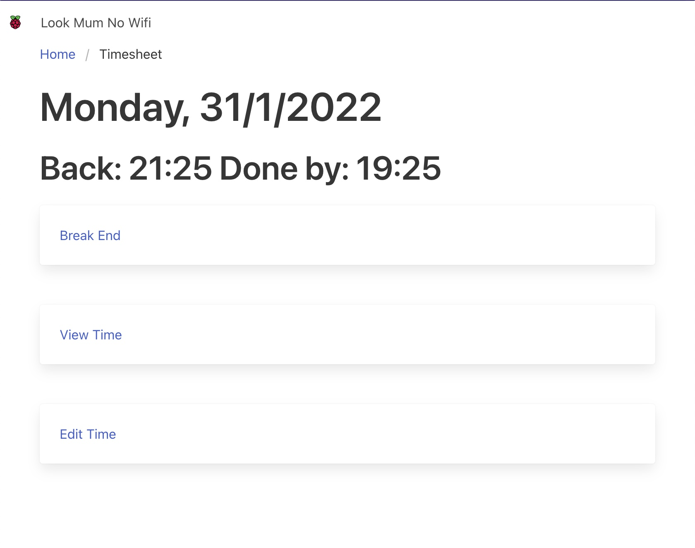
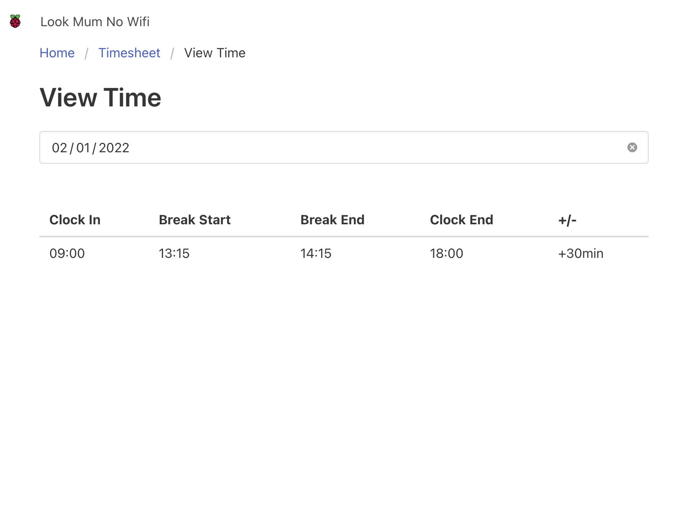
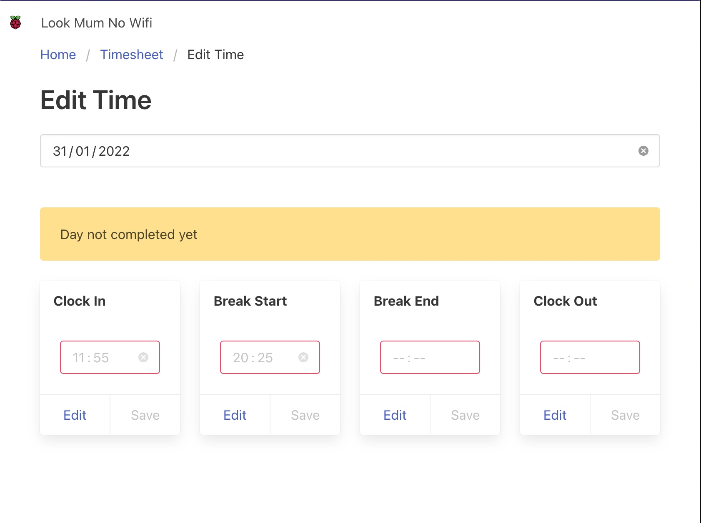
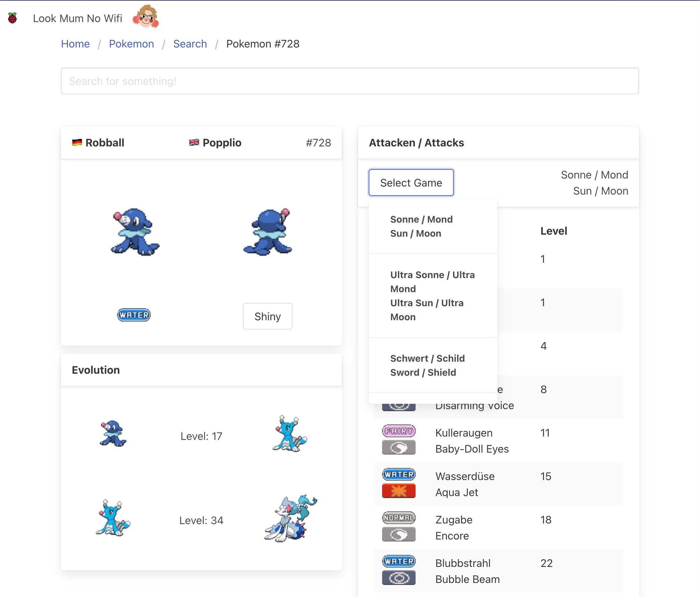
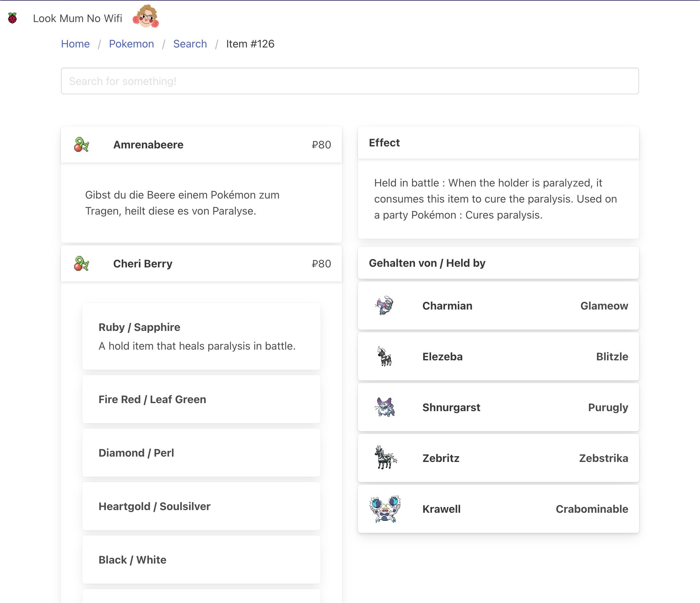

# piserver

Setup for my home Raspberry Pi

Contains the following applications:

- Custom Dashboard application
- Postgres
- Castblock
- Filebrowser
- Plex
- Pihole
- Portainer

---

# Dashboard Features

### Security Disclaimer

When you access the dashboard page for the first time, you will be asked to select a user profile. This user profile will be used by other applications and just works by writing your local IP address to a database. IP addresses can be spoofed, don't deploy this code in an exposed environment, or where you don't trust your users.
In its current design, it is designed for my partner and myself.

## Timesheet

This feature has been designed to aid time tracking when working from home. Personally, I struggle to keep track of time and know that I have worked several hours of overtime without asking for compensation for a variety of reasons. This feature allows me to keep track of my work-hours without
exposing actual timings to an overcomplicated third party platform.

It is designed for 7.5h work days (not accounting for breaks) with a single lunch break taken. It displays the projected finishing time, keeping track of break timings and showing when the workday will be completed if a shorter break is taken.

You can also look at previous time entries to check any overtime, or time owed to the employer which is especially useful if you have a flexitime scheme in place.

If you forget to clock in an activity, you can also go back retrospectively and edit your records.

|                          View Time Screen                          |                          Edit Time Screen                          |
| :----------------------------------------------------------------: | :----------------------------------------------------------------: |
|  |  |

---

## Pokemon

This application is consuming the [PokeAPI](https://pokeapi.co/docs/v2#pokemon-section). It will be extended in the future to only show content relevant to specific games. If you've played any Pokemon game recently and had to look something up you will have scrolled through the wikipedia pages to find something as simple as "At which level does [x] evolve". This is yet another one of those apps, but specific to the information that I find myself requently looking for.

It currently displays all information in German and English, with German being limited to what's available on the API. Every request made is cached locally.

### Search

Search for any Pokemon, Item or Attack in German or English and the search will reveal the first 10 results of each category.

### Pokemon

Show the Pokemon's type, its sprites (shiny available), its evolution path, the option to look at its moveset in different games, and how quickly it will gain XP.

### Item

Show the item's description, buying price, and which Pokemon can hold it in the wild.

|                             Pokemon                              |                               Item                               |
| :--------------------------------------------------------------: | :--------------------------------------------------------------: |
|  |  |

### Plan ahead

- Details about different attacks
- Showing a pokemon's type weakness / multiplier
